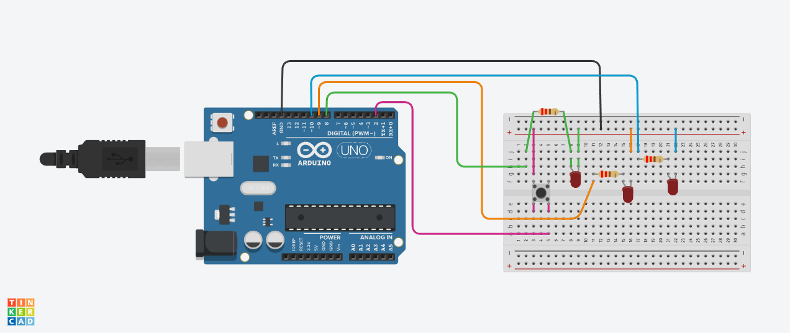

# 06_LED_Blink_SW
Arduino SWによる３LED点滅
# プロジェクト名
06_LED_Blink_SW

## 概要
Arduino を使って 3つの LED を順番に点滅させるプログラムです。  
スイッチ入力に応じて LED の動作を切り替えることもできます。

## 使用部品
- Arduino Uno（または互換機）
- LED × 3（赤・黄・緑など）
- 抵抗（220Ω〜330Ω）× 3
- タクトスイッチ × 1
- ブレッドボード、ジャンパーワイヤー

## 配線図

## 動作仕様
- 電源ONで LED が順番に点滅（例：赤 → 黄 → 緑）
- スイッチを押すと点滅パターンが変化（例：同時点灯 → 交互点滅）

## ファイル構成
06_LED_Blink_SW/
├── src/
│   └── main.cpp（または .ino）
├── .gitignore
└── README.md

## 書き込み方法
1. Arduino IDE または VSCode + PlatformIO を使用  
2. ボードタイプを「Arduino Uno」に設定  
3. シリアルポートを選択  
4. 書き込みボタンでアップロード

## ライセンス
このプロジェクトは個人学習・家庭利用を目的としています。  
商用利用や再配布はご遠慮ください。
